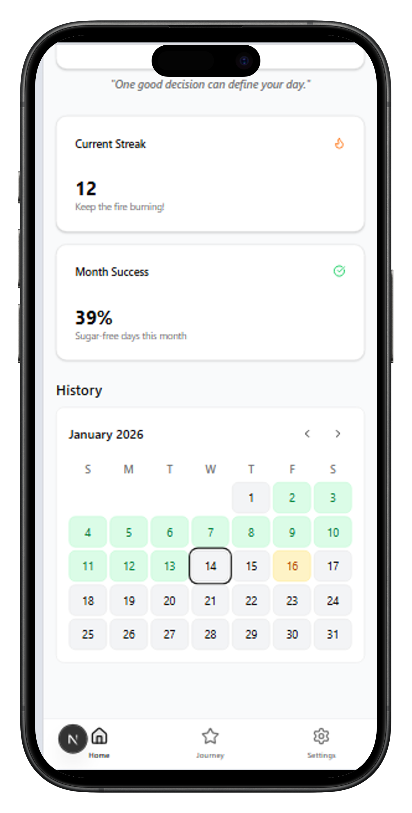

  <h1>🍬 Sugar-Free</h1>
  
<em>Mantenha o foco. Alcance suas metas.</em>

  <!-- Badges -->
  
  
  
  
  

 

  

 

## ✨ Sobre o Projeto

O **Sugar-Free** é uma aplicação focada em ajudar pessoas a manterem-se alinhadas com seus objetivos e metas. Ele atua como um companheiro digital, projetado para que você não perca de vista o que realmente deseja alcançar.

---

## 💡 A Inspiração

O projeto tem um significado muito especial: **vem da inspiração de um projeto pessoal do ano em que fiz o meu primeiro deploy. Hoje, é um app que utilizo diariamente.**  

A motivação principal foi transformar uma ferramenta validada pela minha rotina diária em algo acessível, moderno e funcional, capaz de ajudar outras pessoas a construírem bons hábitos e alcançarem seus próprios objetivos.

---

## 🧠 Interface Inteligente & IA

A interface foi cuidadosamente projetada para ser agradável, moderna e livre de distrações, proporcionando uma excelente experiência de uso.

Mas o grande diferencial está no coração do app: o **Modelo de IA**. Ele analisa, sugere e atua lado a lado com você. A Inteligência Artificial serve para **ajudar o usuário a manter a meta de reduzir o consumo de açúcar** (ou manter um consumo que seja recomendado), oferecendo insights no momento certo e ajustando as interações para garantir que o foco permaneça inabalável.

### ✨ AI Insights (Sua Inteligência Pessoal)

A funcionalidade mais importante do projeto é a nossa tela de **AI Insights**. Essa tela ajuda efetivamente o usuário a focar na sua meta, oferecendo informações detalhadas e amigáveis sobre o progresso.

  

---

## 🚀 Como Testar

O projeto já está no ar! Você pode acessá-lo e testar agora mesmo, sem precisar instalar nada localmente.

🔗 **Acesse o deploy na Vercel:** [https://sugar-free-pink.vercel.app/](https://sugar-free-pink.vercel.app/)

Para começar a usar, basta realizar o cadastro utilizando um **e-mail válido**. Após o login, você terá acesso a todas as funcionalidades do aplicativo, incluindo a tela de insights de IA, para acompanhar sua jornada em direção aos seus objetivos.

---

  
Feito com ☕ e muita dedicação para impulsionar suas metas.

